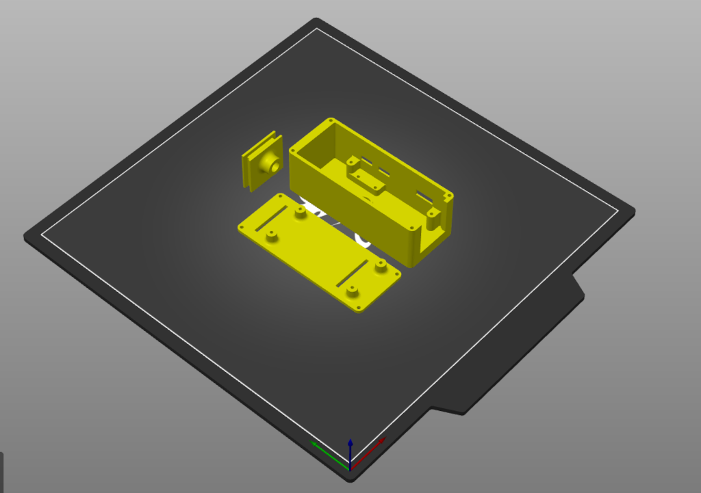
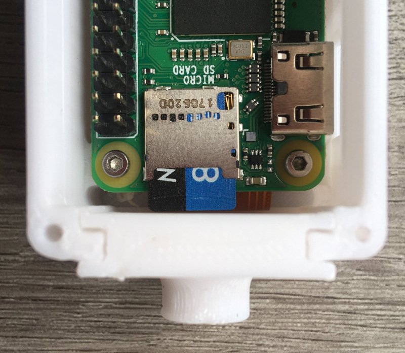

# 3D Files
STL files for 3D printing. All files are easy to print in any hobby grade printer. Gcode and 3mf files were added to help in the selection of settings.

The bottom part is very much a snug fit to keep the SDCard from getting loose, so be careful not to damage the SDCard / connector when assembling it (the [sdcard_lid_tripod_connector](sdcard_lid_tripod_connector.stl) may need some sanding to reduce thickness depending on your printing quality).

### In addition to the 3D parts, you will need some screws:
* M2x6 (4x rpi0, 4x lid).
* M2x5 or M2x4 (4x camera).
* M2x12 (4x Coral USB).

## Acknowledgments:
* 3D case based on https://www.thingiverse.com/thing:2254307
