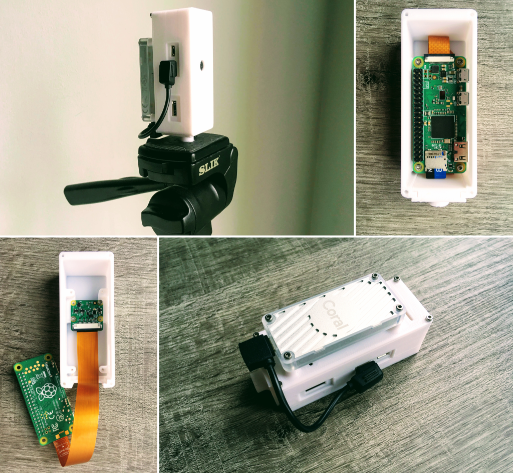

# Maple-Syrup-Pi-Camera
## Low power('ish) smart camera (3D printed) based on the Raspberry Pi Zero W and Google Coral EdgeTPU



People ask me the reason I chose to use the Raspberry Pi Zero for this project considering it's not a powerful single-board computer. I could have tried ready-made smart cameras, but the Raspberry Pi is one of the best selling general purpose computers ever [(beating the Commodore 64, numbers from 4 years ago!)](https://magpi.raspberrypi.org/articles/raspberry-pi-sales), therefore it has a huge community. This makes life much easier when you need to find a driver or how to solve a problem. In addition to that, last year I released my work on a [flexible, collision resilient, quadcopter](https://thecognifly.github.io/) that has as its brain... a Raspberry Pi Zero W! So, I'm quite familiar working with the Zero and I hope the [Raspberry Pi Foundation](https://www.raspberrypi.org/) will soon come up with an upgrade (maybe adding a RP2040 to the RPI Zero PCB?).

## How to build your own

### Hardware
* [Raspberry Pi Zero W](https://www.raspberrypi.org/products/raspberry-pi-zero-w/)
* [Raspberry Pi Camera](https://www.raspberrypi.org/products/camera-module-v2/) ( + [RPI Zero flat cable](https://shop.pimoroni.com/products/camera-cable-raspberry-pi-zero-edition?variant=32092803891283))
* [Coral USB Accelerator](https://coral.ai/products/accelerator)
* [USB-C to micro USB cable](https://www.amazon.co.uk/gp/product/B07WW4J5ZN/) (or [adapter](https://www.amazon.co.uk/ARKTEK-female-Adapter-Samsung-Galaxy-USB-C-Micro/dp/B071W8WQBD/))
* Micro SDCard (if you want to use our image it's recommended 8GB)
* [3D printed parts](3D_files/)

### Software
#### **The easy way**
* Download the image available [here](https://github.com/ricardodeazambuja/Maple-Syrup-Pi-Camera/releases/download/v0.1/maplesyruppicam.img.gz) and flash it to your card using the [Raspberry Pi Imager](https://www.raspberrypi.org/blog/raspberry-pi-imager-imaging-utility/).
* The image available in this repo has lots of interesting stuff pre-installed and its default user is ```pi``` and password ```maplesyrup``` (yup, I love maplesyrup).
* Another interesting thing available is the Jupyter Notebook Server. It helps a lot while testing things. You can launch it by running ```/home/pi/launch_jupyter.sh``` (it's slow at times, but very much usable) and the password is again ```maplesyrup``` (your browser will complain saying it's not a secure connection because the [server is using a self-signed certificate](https://jupyter-notebook.readthedocs.io/en/stable/public_server.html)). 

#### **The hard way (Why can't you go the easy way?!?! LOL)**
* You will, at least, need to install the [libedgetpu and tflite_runtime](https://github.com/ricardodeazambuja/libedgetpu-rpi0/releases/tag/rpi0_tflite_edgetpu). Be aware this tflite_runtime version was compiled for Python 3.7.
* In addition to the software above, you will need to install [Picamera](https://picamera.readthedocs.io/), [Pillow](https://pillow.readthedocs.io/)...

#### **Extra instructions**
* The USB connector is used by the Coral USB Accelerator, therefore it's easier if you use the Maple-Syrup-Pi-Camera [headless](https://www.raspberrypi.org/documentation/configuration/wireless/headless.md). A full example of wifi configuration file is available [here](extras/wpa_supplicant.conf) (you just need to modify it and copy to the boot partition that appears when you connect the SDCard to your computer).
* The image comes with SSH enabled and you can learn more about [how to connect using SSH here](https://www.raspberrypi.org/documentation/remote-access/ssh/README.md).
* If you are a Unix user, you can even [mount the RPI filesystem on your computer and use VSCode remotely](https://ricardodeazambuja.com/linux/2021/05/08/vscode-remotely/).

## Usage examples
* [MultiPose](https://github.com/ricardodeazambuja/MultiPose-EdgeTPU-RPI0)
* [Automatic License Plate Recognition](https://github.com/ricardodeazambuja/ALPR-EdgeTPU-RPI0)
* [Face Mask Detection (Mask, No Mask, Poor Mask)](https://github.com/ricardodeazambuja/MaskDetection-EdgeTPU-RPI0)
* [Examples already installed in the SDCard image](Examples/)

## Speed
The RPI Zero W has a USB 2.0 connection with a theoretical 480Mbit/s (50MB/s) speed, but it will never get close to that because the RPI0 has a single core ARMv6 CPU (no free lunch!). Therefore, the Google Coral USB Accelerator is very often limited by the USB bandwidth, or the ability of RPI0 to exchange data with it. This fact plays a role in keeping the average power consumption low, though. Models that need post-processing or use a custom OP (the EdgeTPU compiler runs these ops in the host) will also suffer from the small USB bandwidth and the weak ARMv6 single core.

## Power consumption:
The RPI Zero W has no protection circuit on its 5V input, therefore it connects the USB power directly to the power supply. That means the Coral USB Accelerator will be directly connected to the power supply allowing it to drain as much current as the power supply and impedance of microUSB + PCB traces allow it. According to the [Google Coral USB Accelerator Datasheet](https://coral.ai/static/files/Coral-USB-Accelerator-datasheet.pdf), the accelerator alone could draw up to 900mA (peak). The RPI Zero W has a [typical power consumption of 150mA](https://www.raspberrypi.org/documentation/hardware/raspberrypi/power/README.md). In my experiments, the Maple-Syrup-Pi-Camera consumes around 160mA at 5V when idle (800mW).

### Examples of power consumption:  
Using a hobby-grade USB power meter (and a power bank that states it can deliver up to 2A at 5V):
* [MultiPose](https://github.com/ricardodeazambuja/MultiPose-EdgeTPU-RPI0) shows peaks of 350mA at 5V (1.75W)
* [Automatic License Plate Recognition](https://github.com/ricardodeazambuja/ALPR-EdgeTPU-RPI0) shows peaks of 400mA at 5V (2W)
* [Face Mask Detection (Mask, No Mask, Poor Mask)](https://github.com/ricardodeazambuja/MaskDetection-EdgeTPU-RPI0) shows peaks of 420mA at 5V (2.1W)

## Acknowledgments:
* 3D parts adapted from https://www.thingiverse.com/thing:2254307
* [Instructions on how to create RPI images using docker](https://ricardodeazambuja.com/rpi/2020/12/29/rpi2docker/)
* Some models and project examples are from https://coral.ai/examples/ and https://github.com/google-coral/pycoral
* SDCard image adapted from the collision resilient quadcopter [CogniFly](https://thecognifly.github.io/).
